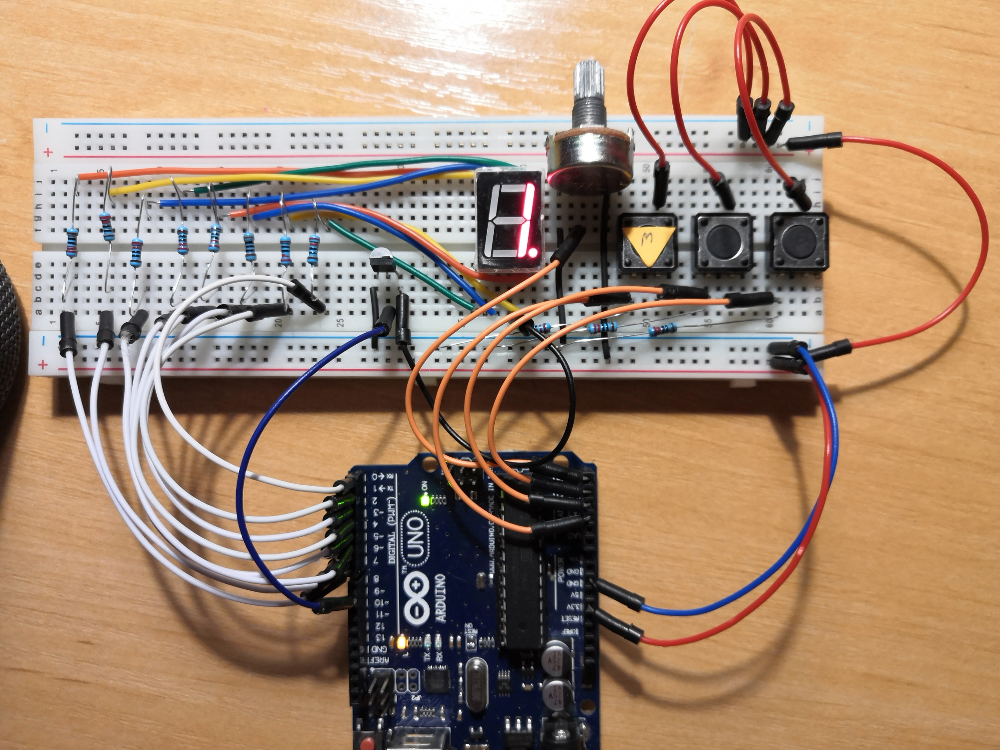
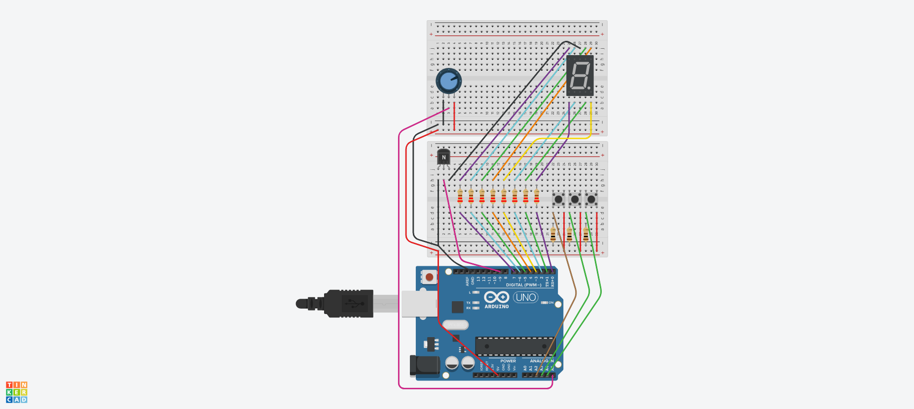
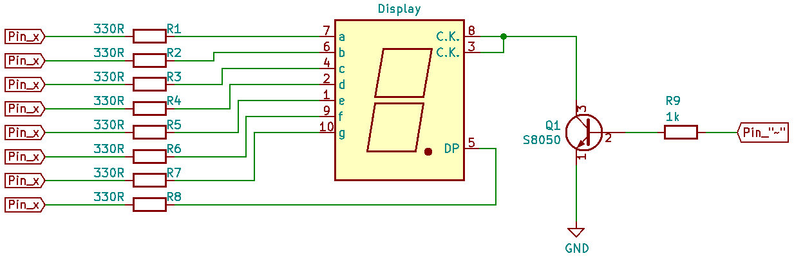
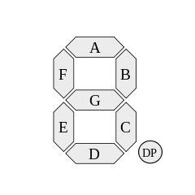
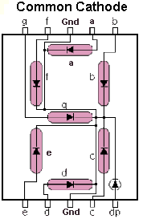

# Dado Electrónico

Este pequeño proyecto consiste en un dado electrónico en el que los números aparecen en el display de forma sucesiva mientras el jugador mantiene dos botones pulsados. Al soltar estos botones el último número que se mostró en el dado es el seleccionado y se muestra de forma parpadeante. La velocidad de aparición de los números es variable y por tanto es posible dificultar hacer trampas para soltar los botones en el número que se desee. Además, por si el usuario no recuerda el número que le salió en el dado, pulsando únicamente uno de los dos botones es posible mostrar el dígito las veces necesarias pero sin parpadear para indicar que el número ya se mostró. 

Por otro lado, si el dado no se ha lanzado y se pulsa sólo uno de los botones, se representa el número 0 para indicar que no se ha tirado el dado en esta ronda.

Además, este dado tiene un segundo modo de funcionamiento en el que se puede variar la luminosidad o brillo de los leds mientras los números se sudecen pero en este modo no es posible parar el dado. 

Cada vez que se cambia del modo cambiar brillo al modo normal, se entiende que se ha comenzado una nueva ronda y por tanto el dado no recuerda el último valor representado y si se pulsa alguno de los botones, mostrará el número 0 como si se hubiese reiniciado. Se muestra este comportamiento en el siguiente GIF:

  
  

Consta de los siguientes componentes: 
* Display de 7 segmentos donde se mostrarán los dígitos
* 3 Pulsadores: cambiar modo, pulsación simultánea y control del brillo
* Transistor S8050: ayuda a regular la diferencia de potencial del display para así poder modificar su brillo
* Potenciómetro: señal de entrada analógica para regular la velocidad de funcionamiento

## Especificaciones del funcionamiento
Voy a concretar algunos detalles del funcionamiento del dado en sus dos diferentes modos. 

### Modo normal o modo1
En este modo, el display se utiliza para representar los dígitos y el led del punto del display se muestra apagado para diferenciar visualmente en qué modo nos encontramos. Además, por hacer una doble comprobación, el led de la placa, también conocido como LED_BUILTIN, se encuentra apagado. 

### Modo variación del brillo
Los números se suceden a la velocidad establecida y tanto el led punto del display como el led LED_BUILTIN se encuentran encendidos mientras los números se suceden. El brillo se establece dentro de este modo con ayuda de una variable. Esta variable es la que se utiliza para cambiar la tensión del pin (pin PWM) que se conecta como base del transistor para modificar la luminosidad de los leds del display. Para incrementar o disminuir el valor de esta variable basta con entrar en este modo y pulsar el botón **+** o **-** respectivamente. 

## Display y mi configuración para utilizarlo
Para controlar el display, decidí hacerlo mediante acceso a puerto, en mi caso conecté los 8 pines de leds del display a cada uno de los pines del puerto D. He de decir que los conecté sin criterio, según la logitud de los cables que iba pelando y colocando en la protoboard. 

En este otro proyecto, en el apartado máscaras, explico un poco más detalladamente cómo se puede definir cada variable asociada a cada dígito para representarlo y cómo aplico estas variables al puerto D para que se enciendan los leds en el display.
[Ankgiel - Proyecto Display con máscaras](https://github.com/ankgiel/Display_mascaras)

    
 
Asignación de cada segmento en mis pines digitales 

        5==A
    6==F    4==B
        7==G
    0==E    1==C
        2==D        3==DP

Pin E del display conectado al pin digital 0
...
Pin G del display conectado al pin digital 7
    
         PIN: 7 6 5 4 - 2 1 0 
    SEGMENTO: G F A B P D C E 

Ejemplo para representar el número 3:

         A=1            ---
            B=1             |
         G=1            ---
            C=1             |
         D=1            ---
         
Se deben poner a HIGH los pines A, B, C, G y D. Por tanto, siguiendo el orden de mis pines
    
    SEGMENTO: G F A B P D C E
    Número 3: 1   1 1   1 1

Los demás pines del display se pondrán a LOW, por tanto el número 3 quedaría definido como

    Número 3: 1 0 1 1 0 1 1 0
    
La representación de cada número está sujeta al esquema de conexión realizado, según qué pin del puerto D hayamos conectado a cada pin del display. Por tanto, cada uno debe realizar una nueva codificación para la representación de cada números si modifica las conexiones. La mía queda así:

    ORDEN MI PUERTO D:
         PIN: 7 6 5 4 3 2 1 0
    SEGMENTO: G F A B P D C E

    Número 0: 0 1 1 1 0 1 1 1
    Número 1: 0 0 0 1 0 0 1 0
    Número 2: 1 0 1 1 0 1 0 1
    Número 3: 1 0 1 1 0 1 1 0
    Número 4: 1 1 0 1 0 0 1 0
    Número 5: 1 1 1 0 0 1 1 0
    Número 6: 1 1 1 0 0 1 1 1
    Número 7: 0 0 1 1 0 0 1 0
    Número 8: 1 1 1 1 0 1 1 1
    Número 9: 1 1 1 1 0 1 1 0

Y esto es todo, espero que os pueda ser útil. Podéis encontrar todo el código comentado al detalle aquí:
[Código Arduino (.ino)](https://github.com/ankgiel/dado_electronico_v3.ino)
